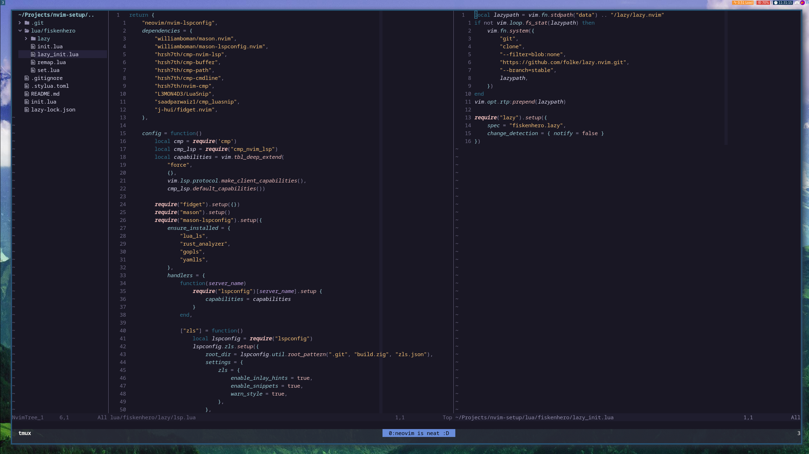

# My NeoVim setup

I finally did an attempt to go over to NeoVim and I think I've managed to do quite the similar setup.

## Plugins

I'm using Lazy to install & setup all the plugins.

## Looks

## Can I modify it?
Good luck.
